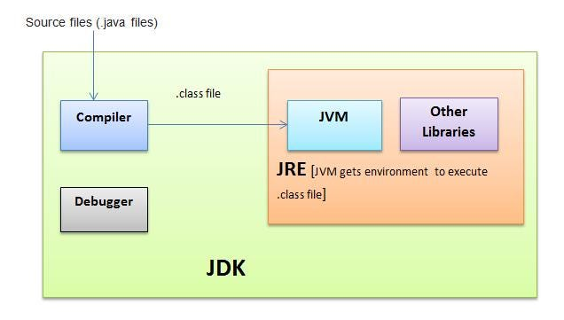

# How does Java Code run:

In order to write and run a Java program, you need to install a software program called Java SE Development Kit (or JDK for short, and SE means Standard Edition). Basically, a JDK contains: JRE(Java Runtime Environment): is the core of the Java platform that enables running Java programs on your computer.

## JDK [Java Development Kit]:

> The Java Development Kit is a distribution of Java Technology by Oracle Corporation. It implements the Java Language Specification and the Java Virtual Machine Specification and provides the Standard Edition of the Java Application Programming Interface.

> The JDK is a development environment for building applications, applets, and components using the Java programming language. The JDK includes tools useful for developing and testing programs written in the Java programming language and running on the Java platform.

## JRE [Java Runtime Environment]:

> The Java Runtime Environment (JRE) runs on top of the operating system, providing additional Java-specific resources. The Java Development Kit (JDK) and JRE interact to create a sustainable runtime environment that runs Java program files on any machine. The JRE uses three core components to work.

## JVM [Java Virtual Machine]:

> A Java virtual machine is a virtual machine that enables a computer to run Java programs as well as programs written in other languages that are also compiled to Java bytecode. The JVM is detailed by a specification that formally describes what is required in a JVM implementation.

