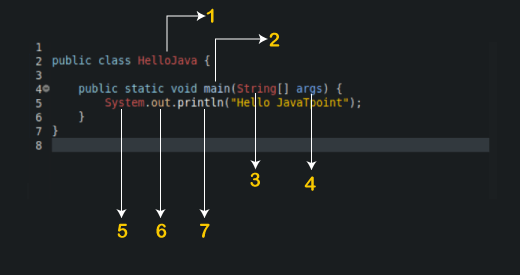
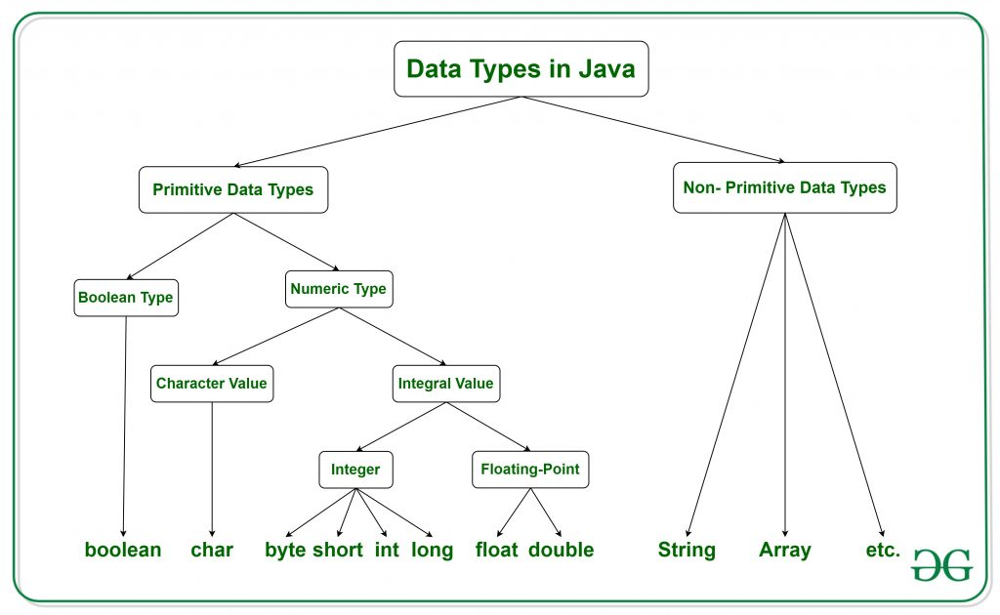

# Variable in Java

> In Java, a variable is a container for holding data of a particular type. Data types in Java specify the type of data that a variable can hold. There are two types of data types: primitive and reference types.

> Java has a set of rules for naming variables, known as naming conventions, which should be followed to improve code readability and maintainability. These conventions specify the naming format for different types of variables, such as class names, constants, and instance variables.

## concept of variables and their use in Java.

> In Java, variables are used to store values that can be used by a program. A variable is a container that holds a value, such as an integer or a string. Before using a variable, it must be declared with a data type, such as int or String, and an identifier or name.

- to declare a variable that holds an integer value, the following code can be used:

```
int num

```

- This creates a variable named "num" of type int. After declaring a variable, a value can be assigned to it using the assignment operator (=):

```
int num = 15;

```

- This sets the value of the "age" variable to 25. Variables can also be initialized when they are declared, like this:

```
  int num = 25;

```

Variables can be used in many ways, such as to perform calculations, store user input, or keep track of program state. It is important to choose meaningful and descriptive variable names, following Java naming conventions.

```
a = 10, b = 5;


2*(a+b)

where,

2 == Literals

a, b == Variable

Whose value can be change

```

### Literals:

1, 2, 3, 4, 5....0...

'a', 'b', 'c', 'd', 'A', 'B', 'C'....

'@', '\*'

We have to declare the value.

```
int a = 10;

int == Integer Variable

a == variable

10 == variable's value

```

### Identifer:

> They are names given to a class, variable, package, method, or interface and allow the programmer to refer to the specific item from any place in the program. In other words, a Java identifier is simply a word or a combination of characters used in a Java program.



# Data Type In Java

In Java, variables are used to store data in computer memory. When you create a variable, you give it a name and a data type. The data type determines the kind of information that can be stored in the variable.

#### There are two main types of data types in Java:

1. Primitive:

> Primitive data types include integers, floating-point numbers, characters, and booleans. These data types have a fixed size in memory and can hold a single value at a time.

2. Reference (Non-primitive):

> Reference data types include objects, arrays, and classes. These data types store references to objects in memory, rather than the actual object data itself. They can hold multiple values and are not limited in size like primitive data types.



### Difference Between Primitive And Non-Primitive:

> It's important to understand the differences between these data types and when to use them. For example, primitive data types are faster and require less memory than reference data types, but they are limited in their capabilities. Reference data types, on the other hand, are more flexible and can store more complex data, but they require more memory and can be slower.

- **Java is typed language, C++/ Python are also typed language**

  > We have to declared the data type of the variable.

- **JavaScript is non-typed language**

### Size of Data Type:


```
// Sum of a and b

public class Sum {
    public static void main(String[] args) {
        int a = 40;
        int b = 5;
        int sum = a + b;
        System.out.println(sum);
    }
}

```

### Comments in Java:

- One Line Comment

```
 // hi there!
```

- Multi Line Comments

```
/*
Hi!
There
*/
```

## Input In Java

> next
> nextLine
> nextInt
> nextByte
> nextFloat
> nextDouble
> nextBoolean
> nextShort
> nextLong

### How to take input in java:

```
import java.util.Scanner;

public class Input {
    public static void main(String[] args) {
        Scanner sc = new Scanner(System.in);
        String input = sc.next();

        System.out.println(input);

        sc.close();
    }

}
```

```
        // input first name
        String name = sc.next();
        System.out.println(name);

        // input Full name
        String FullName = sc.nextLine();
        System.out.println(FullName);

        // input integer
        int number = sc.nextInt();
        System.out.println(number);

        // input float value
        float price = sc.nextFloat();
        System.out.println(price);

```

### Input From User:

```
import java.util.*;

public class InputFromUser {
    public static void main(String[] args) {
        Scanner sc = new Scanner(System.in);
        System.out.println("Enter the value of a: ");
        int a = sc.nextInt();
        System.out.println("Enter the value of b: ");
        int b = sc.nextInt();

        System.out.println(a + b);

        sc.close();
    }

}

```

## Type Conversion in Java:

Java provide various data type just likely any other dynamic language such as boolean, char, int, unsigned int, signed int, float, double, long etc. in total providing 7 types where every data types acquires diffrent space while storing in memory, When you assign a value of one data type to another, the two types may not be compatable with each other. If the data types are compatable, then Java will perform the coonversion automatically known as Automatic Type Conversion, and if not then they need to be cast or converted explicitly. Forexample assigning an int value to a long variable.

### **Conversion happent when:**

- **Type Compatable.**

- **Destination Type > Source Type**

#### Possible:

```
int a = 27;
long b = a;
```

#### Lossy Conversion:

```
// occur error
float a = 14.7;
int b = a;

// lossy Conversion

float a = 14.7;
int b = (int)a;

```

## Type Conversion == Widening == implicit

```
// Erroroccur
Scanner sc = new Scanner(System.in);
int number = sc.nextFloat();
System.out.println(number);

float num = sc.nextInt();
System.out.println(num);
```

## Type Casting == Narrowing == Explicit Conversion (Loss of data)

```
float a = 25.76f;
int b = a; ---> X

int b = (int)a;
```

**OUTPUT**

b = 25

```
int marks = (int)99.99f;

char ch = 'a';
int num = ch;
System.out.println(num);
```

## Type Promotion in Expressions:

1. Java automatically promotes each byte, short or char operand to int when evaluating an expression.

2. If one operand is long, float or double the whole expression is promoted to long, float or double respectively.

Example:-

```
char a = 'a';
char b = 'b';

// a, b ---> converted into (int)

System.out.println( b - a );
```

**Convert only when expression like ( +, -, /, \*, %)**

```
char a = 'a';
char b = 'b';

System.out.println( (int)(b) );
System.out.println( (int)(b) );
System.out.println( b-a );

```

> **Output:** 98-97 = 1(output)

Example:-

```
char a = 'a';
char b = 'b';

char c = a - b;
System.out.println( c );
```

**Error: cause a-b already converted in int and you can't store int into char.**

Exapmle:-

```
short a = 5;
byte b = 25;
char c = 'c';

// byte bt = a + b + c; ---> error

byte bt = (byte)(a + b + c);    //lossy conversion
System.out.println(bt);
```

**Output:** -127

Example:-

```
  int a1 = 10;
  float b1 = 20.25f;
  long c1 = 25;
  double d = 30;
  double ans = a1 + b1 + c1 + d;
  System.out.println(ans);
```

**Output:** 85.25(double)

```
// int ans = a1 + b1 + c1 + d;
System.out.println( ans );

// lossy conversion from double to int
```

**Wrong:**

```
byte b = 5;
byte a = b * 2;

// lossy conversion from int to byte (promotion in expression)
```

**Righht:**

```
byte b = 5;
byte b = (byte) (b * 2);
```
