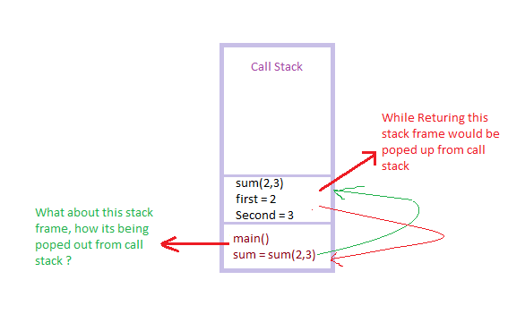

# Finctions/Methods

In Java, methods are reusable blocks of code that perform specific tasks. They are an essential part of Java programming and help to reduce code duplication and improve code maintainability. Methods can be called from anywhere in the program and can take in parameters, and return values.

## Creating Methods in Java:

> In Java, a method is a block of code that performs a specific task and can be reused throughout the program. A method is a subroutine or a function, which may or may not return a value.

#### Syntax:

```
access_modifier return_type method_name (parameter_list) {
   // method body
}
```

- Access modifiers specify the level of access to the method. It can be public, private, protected, or default.

- Return type indicates the type of value the method returns. If the method does not return any value, the return type is void.

- Method name is the name that is used to refer to the method throughout the program.

- Parameter list contains the input parameters that the method can accept. It can be empty if the method does not take any input.

#### Example:

```
public class FunctionCode {

    public static void printHelloWorld() {
        System.out.println("Hello World");
        System.out.println("Hello World");
        System.out.println("Hello World");

    }

    public static void main(String[] args) {
        printHelloWorld();
    }

}
```

```
public int sum(int a, int b) {
   int result = a + b;
   return result;
}
```

This method takes two integer parameters, a and b, and returns the sum of these two integers as an integer value.

Methods help in organizing code and improve code readability, reusability, and maintenance. They allow us to break down the program into smaller, manageable parts that can be easily tested and debugged.

## Method parameters and their use:

> method can take zero or more parameters when it is called. Parameters are used to pass values or reference types to a method. Method parameters are declared within the parentheses of the method signature.
>
> A method can have multiple parameters, and each parameter is separated by a comma. Parameters can have any data type, including primitives, objects, or arrays. When a method is called, the arguments provided to the method must match the parameter types and order of the method declaration.

#### Example:

```
public static int add(int a, int b) {
    return a + b;
}
```

#### This method can be called with two integer arguments like this:

```
int result = add(2, 3); // result is 5
```

- In addition to traditional parameters, Java also supports varargs (variable-length arguments) that allow methods to take a variable number of arguments of the same type. The syntax for varargs is to use three dots (...) after the type of the last parameter, like this:

```
public static int sum(int... numbers) {
    int total = 0;
    for (int n : numbers) {
        total += n;
    }
    return total;
}
```

**This method can be called with any number of integer arguments, like this:**

```
int result = sum(1, 2, 3); // result is 6
result = sum(4, 5, 6, 7); // result is 22
```

Method parameters are an essential concept in Java, as they allow methods to take inputs and produce results based on those inputs.

## Difference between parameters and arguments:

> the terms "parameters" and "arguments" are often used interchangeably, but they have different meanings.

> A parameter is a variable defined in a method's signature. It is a placeholder for the actual value that will be passed into the method when it is called.

> An argument is the actual value that is passed to the method when it is called. It is the value that will be assigned to the parameter in the method.

**For Example:**

```
public static void swap(int a, int b) {
        // swap two vlaues
        int temp = a;
        a = b;
        b = temp;
}
```

In this method, num1 and num2 is a parameter. It is a variable that will hold the value of the argument passed to the method.

- When we call the method, we pass an argument for the name parameter:

```
int a = 5;
int b = 10;
swap(a, b);
```

In this case, the argument is the `int a, int b`. It is passed to the swap method and assigned to the parameter.

> In summary, parameters are the placeholders for values that will be passed to a method, while arguments are the actual values that are passed to the method.

### Call by value:

> The call stack is a crucial data structure that manages method execution and variable scope in Java. The stack depth, or the number of active method calls it can hold, is an important consideration when dealing with recursive functions or deep call chains.


